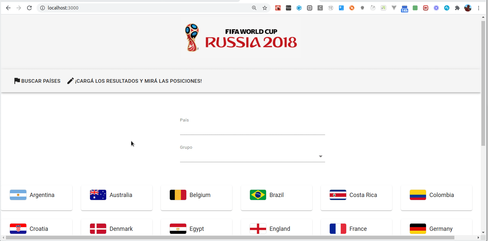

# Mundial 2018 Rusia (React Context)

[](https://travis-ci.org/uqbar-project/eg-mundial2018-react-context)



La aplicación permite la reutilización de varios componentes:

- `countryRow`: muestra la bandera y el nombre de un país, y lo utilizamos en la búsqueda de países que participan del mundial, en la fila que nos permite cargar los resultados de los partidos y en la tabla de posiciones.
- `selectGroup`: permite seleccionar un grupo para filtrar los países participantes de la copa o bien para seleccionar la tabla de posiciones y la carga de los resultados de los partidos

# Rutas

- la ruta raíz '/' muestra la búsqueda de países que participan del mundial
- la ruta '/fixture' permite ver/cargar los resultados de los partidos y la tabla de posiciones

# Fixture: resultados + tabla de posiciones

## Armado de la tabla de posiciones

Para armar la tabla de posiciones, tomamos como input la lista de partido y hacemos un doble corte de control:

- primero por grupo
- luego por país

Es decir, tenemos un mapa:


Recorremos los partidos generando o actualizando el mapa por grupo y país (archivo _positionTable.js_):

```js
const { matches } = useContext(Context)
const positions = new Map()
matches.filter((match) => match.matchesGroup(group)).forEach(match => {
    const group = match.group()
    const groupPosition = positions.get(group) || new GroupPosition(group)
    groupPosition.processMatch(match)
    positions.set(group, groupPosition)
})
```

El método processMatch de PositionGroup hace el procesamiento para el equipo local y el visitante:

```js
processMatch(match) {
    this.searchPositionItem(match.teamA).processMatch(match.goalsA, match.goalsB)
    this.searchPositionItem(match.teamB).processMatch(match.goalsB, match.goalsA)
}

searchPositionItem(team) {
    let result = this.positionItems.find(item => item.team.matches(team))
    if (!result) {
        result = new PositionItem(team)
        this.positionItems.push(result)
    }
    return result
}
```

Veamos el método processMatch del objeto de negocio positionItem, que representa una línea dentro de la tabla de posiciones:

```js
processMatch(goalsOwn, goalsAgainst) {
    if (goalsOwn === undefined || goalsAgainst === undefined) return
    this.goalsOwn += goalsOwn
    this.goalsAgainst += goalsAgainst
    if (goalsOwn > goalsAgainst) this.won++
    if (goalsOwn < goalsAgainst) this.lost++
    if (goalsOwn === goalsAgainst) this.tied++
}
```

> Ojo que no es conveniente preguntar `if (!goalsOwn || !goalsAgainst)`, porque 0 es falsy. Por lo tanto cualquier partido en el que alguno de los equipos no haya metido goles no va a sumar en la tabla de posiciones.

Para mostrar la tabla, el componente PositionTable (vista) en su método render dibuja la tabla de la siguiente manera:

```js
return (
    <Card key={'cardPosiciones'}>
        <CardContent key={'contentPosiciones'}>
            <h3>Tabla de posiciones</h3>
            {[...positions].map((itemGroup) => {
                const group = itemGroup[0]
                const positions = itemGroup[1].positions()
                return <PositionGroupTable group={group} positions={positions} key={'positions_group_' + group} />
            }
            )}
        </CardContent>
    </Card>
)
```

Partimos de positions, que es el mapa que construimos previamente. Como el mapa de ECMAScript no conoce la función map, tenemos que pasarlo a una lista utilizando el _spread operator_ `[...positions]`. Esto nos da una lista de objetos que tiene `{grupo: nombre_grupo, groupPosition: lista_de_equipos}`. Pero como la lista de equipos no está ordenada, llamamos a un método en groupPosition que ordena los equipos por puntos:

```js
// en GroupPosition
positions() {
    return this.positionItems.sort((a, b) => b.order - a.order)
}

>>PositionItem
get order() {
    return this.points * 10000 + this.goalAverage * 100 + this.goalsOwn
}
get points() {
    return this.won * 3 + this.tied
}
```

Bueno, no solo por puntos, también por diferencia de gol y goles a favor.


# React-Context: Estado compartido entre componentes

Tenemos dos componentes que tienen un estado compartido: 

- el componente Results toma como input los partidos del mundial para eventualmente filtrar los de una zona seleccionada (o directamente mostrar todos), y permite editar los resultados del mundial
- el componente PositionTable toma como input los partidos del mundial para armar las tablas de posiciones (y adicionalmente filtrar por zona)

Pero además, si alguien modifica un resultado (componente _MatchRow_ hijo del componente padre _Results_), eso debería actualizar la tabla de posiciones. React tiene mecanismos para actualizar estados desde un componente hacia otros, pero esta es una buena ocasión para incorporar **React Context** a nuestra aplicación, que nos va a permitir manejar un estado compartido entre componentes para simplificar el esquema de notificaciones ante un cambio.

Para una explicación más detallada podés consultar [el ejemplo del contador con React Context](https://github.com/uqbar-project/eg-contador-react-context)

Veamos cómo se implementa dentro del ejemplo del mundial.

## Context

El context va a guardar los resultados, inicialmente tendrá la lista de partidos vacía.

Dentro de nuestro archivo _Context.js_, definimos nuestro `Provider` que va a tener el estado global de nuesta aplicación :

```js
export const Context = createContext()

export const Provider = ({ children }) => {
    const [matches, setMatches] = useState(new MatchService().getMatches())
    const value = {
        matches,
        updateMatch: (matchToUpdate) => {
            const indexMatchToReplace = matches.findIndex((match) => match.key === matchToUpdate.key)
            matches[indexMatchToReplace] = matchToUpdate
            setMatches([...matches])
        }
    }
    return (
        <Context.Provider value={value}>
            {children}
        </Context.Provider>
    )
}
```

Mediante los [hooks](https://es.reactjs.org/docs/hooks-intro.html)

- `useState` mantenemos el estado del contexto, que son los partidos disputados
- `value` nos ofrece un mecanismo para mutar ese estado cada vez que nos pasen el partido a actualizar. Simplemente lo que hacemos es buscarlo en la lista de partidos, pisar el resultado del partido con el nuevo (ej. en lugar de Argentina 0, Croacia 3 podríamos decirle Argentina 3, Croacia 2) y luego debemos llamar al setMatches para que se propague ese cambio a cada uno de los hijos (en nuestro caso los que lo deben tomar son el de carga de partidos, para ver el input cambiado y la tabla de posiciones que se recalcula en base a los partidos)

Para más información hay una [web](https://wattenberger.com/blog/react-hooks) que tiene una explicación de como migrar a hooks.

Sabiendo esto ahora podemos conectar nuestro componente `Results` al contexto

```js
export const Results = ({ group }) => {
    const { matches } = useContext(Context)
    const groupMatches = matches.filter((match) => match.matchesGroup(group))
    return (
        <div>
            {groupMatches.map(match => <MatchRow data-testid={match.key} match={match} key={match.key} />)}
        </div>
    )
}
```

Podemos ver un `<>` suelto, eso no se parece a ningún elemento a HTML, porque es un `Fragment`, la expresión JSX equivalente al Null Pattern de un componente. Los [fragments](https://reactjs.org/docs/fragments.html) surgen a partir de que un componente de react está obligado a devolver sí o sí un solo elemento (div, span, p, etc). Entonces si nosotros quisiéramos devolver 2 o más elementos sin tener un contenedor, porque arruina nuestros estilos, podemos usar fragment que es un tag vacío que cuando se renderiza en la web va a desaparecer.

Y nuestro componente `MatchRow` ahora utiliza la función `updateMatch` del contexto para actualizar el partido y que el cambio se vea reflejado en la tabla de posiciones

```js
export const MatchRow = ({ match: matchProps }) => {
    const { updateMatch } = useContext(Context)
    const [match, setMatch] = useState(matchProps)

    const changeGoal = (match, team, goals) => {
        match.updateScore(team.name, Math.trunc(goals))
        updateMatch(match)
        setMatch(match)
    }
    ...
```

## Testing

Tenemos tres test bastante integrales, los dos primeros nos sirven para probar los dos escenarios básicos de la búsqueda de países

- por letras
- por grupo

```js
it('buscar F devuelve la lista con un solo país, Francia', async () => {
  const { getByTestId } = render(<CountrySearch />)
  const countrySearch = getByTestId('country')
  userEvent.type(countrySearch, 'F')
  const allCountries = await screen.findAllByTestId('countryRow')
  expect(allCountries[0]).toHaveTextContent('France')
})

it('buscar el grupo A devuelve los países que particpan en él', async () => {
  const { getByRole } = render(<CountrySearch />)
  fireEvent.mouseDown(getByRole('button'))
  const listbox = within(getByRole('listbox'))
  fireEvent.click(listbox.getByText(/A/i))
  const allCountries = await screen.findAllByTestId('countryRow')
  expect(allCountries.length).toBe(4)
  const groupACountries = allCountries.map(country => country.textContent).sort((a, b) => a >= b)
  expect(groupACountries).toStrictEqual(['Egypt', 'Russia', 'Saudi Arabia', 'Uruguay'])
})
```

Algunos trucos que utilizamos:

- en el primer test
  - `userEvent.type(countrySearch, 'F')` es una variante más feliz que tener que disparar un `fireEvent.change` respetando el json `{ target: { value: 'F' }}`
  - una vez que seleccionamos, tenemos que esperar a que se actualice el estado y vuelva a renderizar, por eso invocamos a `screen.findAllByTestId('countryRow)`
- en el segundo test
  - simular la búsqueda del combo requiere presionar el botón que está a la derecha para abrir la lista desplegable, posicionarse en el listbox y presionar la opción que tiene el grupo A, esas son las tres líneas mouseDown, getByRole y luego un click
  - luego hay que esperar que renderice nuevamente la página, tomamos los valores `innerHTML` de cada componente `countryRow`, y para estar seguros de que filtró los países que queremos los ordenamos alfabétiamente

Por último el test que verifica la carga de un resultado requiere ser específico respecto al data-testid que queremos, por eso cada input debe considerar

- el partido: `russia_saudi-arabia`
- el equipo que se está cargando: `russia`
- y algún identificador de qué input es: `goles`

eso nos permite accederlo rápidamente

```js
it('results show Russia made 5 goals against Saudi Arabia', async () => {
  const { getByTestId } = render(
    <Provider>
      <Results />
    </Provider >
  )
  const golesRussia = getByTestId('russia_saudi-arabia_russia_goles')
  expect(golesRussia).toHaveValue(5)
})
```

Otro truco importante es que debemos pasarle a Material el data-testid como una `input-prop`:

```js
<TextField
    required
    inputProps={{ 'data-testid': `${match.key}_${team.key}_goles` }}
```

ya que así no funciona

```js
<TextField
    required
    data-testid={`${match.key}_${team.key}_goles`}
```
